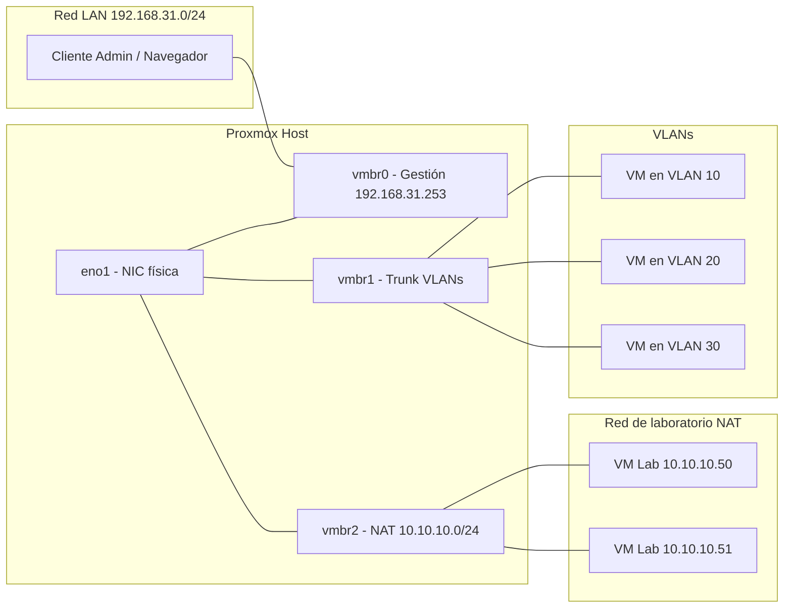

# Proxmox VE Lab 

Este repositorio documenta la instalación y configuración inicial de un laboratorio basado en **Proxmox VE 9.0** (Debian 13 *Trixie*).

---

## 🔹 Paso 1 – Configuración de repositorios

Por defecto, Proxmox incluye repositorios *enterprise* que requieren licencia.  
Se reemplazaron por los repositorios **no-subscription** para poder actualizar sin errores.

### Pasos ejecutados

```bash
# Deshabilitar repos enterprise de PVE y Ceph
rm -f /etc/apt/sources.list.d/pve-enterprise.list
rm -f /etc/apt/sources.list.d/pve-enterprise.sources
rm -f /etc/apt/sources.list.d/ceph.list
rm -f /etc/apt/sources.list.d/ceph-squid.list
rm -f /etc/apt/sources.list.d/ceph.sources

# Crear repositorio no-subscription en formato deb822
cat >/etc/apt/sources.list.d/proxmox.sources <<'EOF'
Types: deb
URIs: http://download.proxmox.com/debian/pve
Suites: trixie
Components: pve-no-subscription
Signed-By: /usr/share/keyrings/proxmox-archive-keyring.gpg
EOF

# Actualizar sistema
apt update && apt -y dist-upgrade
reboot
```
---
## 🔹 Paso 2 – Configuración de red

En Proxmox la red se gestiona con **bridges** (`vmbrX`).  
En este laboratorio se dejaron tres puentes configurados:

- `vmbr0` → gestión (con IP fija en la red principal, VLAN-aware).  
- `vmbr1` → trunk VLANs para VMs/LXC (sin IP).  
- `vmbr2` → red NAT de laboratorio (10.10.10.0/24).  

---

### Estructura usada

En lugar de sobrescribir `/etc/network/interfaces`, se mantienen los bridges adicionales en `/etc/network/interfaces.d/`.

---

### 🔹 vmbr0 – Bridge de gestión (archivo principal)

Archivo `/etc/network/interfaces`:

```bash
auto lo
iface lo inet loopback

iface eno1 inet manual

auto vmbr0
iface vmbr0 inet static
    address 192.168.31.253/24
    gateway 192.168.31.1
    bridge-ports eno1
    bridge-stp off
    bridge-fd 0
    bridge-vlan-aware yes

# Cargar configuraciones adicionales
source /etc/network/interfaces.d/*

🔹 vmbr1 – Trunk para VLANs

Archivo /etc/network/interfaces.d/vmbr1.cfg:

```bash
auto vmbr1
iface vmbr1 inet manual
    bridge-ports none
    bridge-stp off
    bridge-fd 0
    bridge-vlan-aware yes
```     

🔹 vmbr2 – NAT de laboratorio
Archivo /etc/network/interfaces.d/vmbr2.cfg:

```bash
auto vmbr2
iface vmbr2 inet static
    address 10.10.10.1/24
    bridge-ports none
    bridge-stp off
    bridge-fd 0
    post-up   echo 1 > /proc/sys/net/ipv4/ip_forward
    post-up   iptables -t nat -A POSTROUTING -s 10.10.10.0/24 -o vmbr0 -j MASQUERADE
    post-down iptables -t nat -D POSTROUTING -s 10.10.10.0/24 -o vmbr0 -j MASQUERADE

```
---



